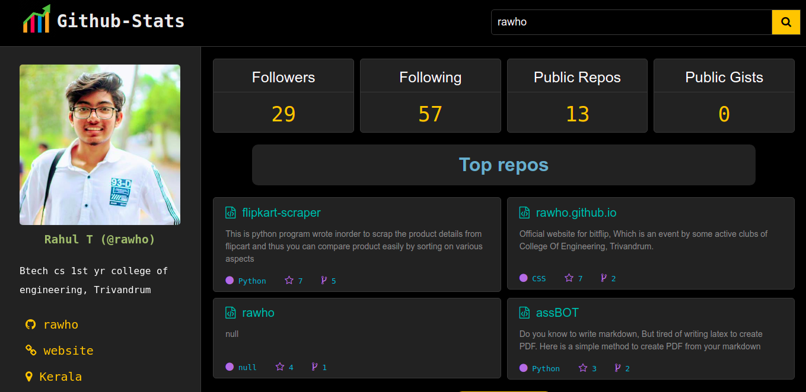

 
 <h2 align="center" style="color:#ffc107;">GitHub Stats</h2>
 
Get the details of the developers at your fingertips

# Features
- You can search for any user in the github and get their details
- Bookmark other repos for later reference (On Development stage)

# ScreenShot

# Future Plans
- [ ] Add a chart for the contributions of the user
- [ ] Bookmark functionality
    - bookmark data can be stored in the local storage of browser

 Contributions are Welcome 

